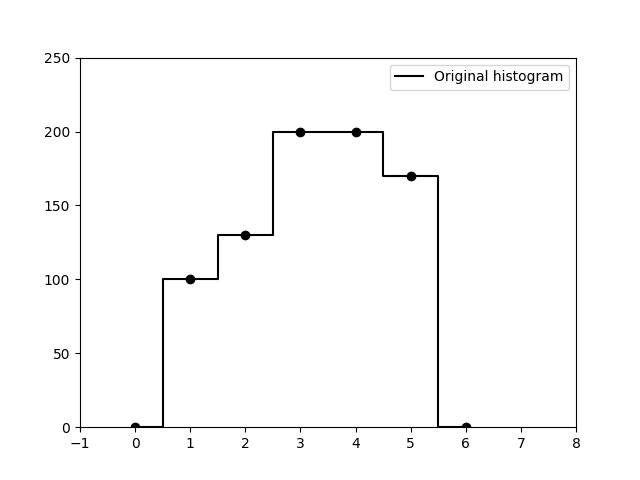
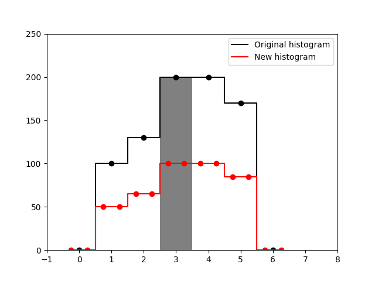
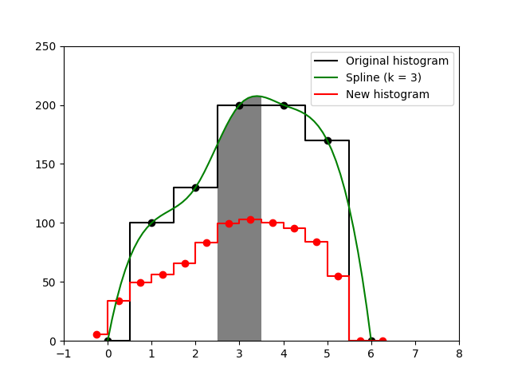

# hari
## histogram arbitrary rebinning intelligently

The program `hari` can be used to change the binning of a given histogram (rebin a histogram) while trying to preserve the statistical fluctuations. The fluctuations are assumed to follow a Poissonian distribution which is commonly assumed, for example, in counting experiments that produce histograms of a continuous variable.

# Table of Contents

 1. [Introduction](#introduction)

    1.1 Simple redistribution
    
    1.2 Interpolation
    
    1.3 Statistics
    
    1.4 Example: Why deterministic rebinning is harmful

 2. [Prerequisites](#prerequisites)
 3. [Usage](#usage)
 4. [License](#license)
 5. [References](#references)

## 1 Introduction <a name="introduction"></a>

Given an initial histogram `h` with the bin contents `h[i]`, where `0 <= i <= N_h`, the goal is to find the bin contents `H[j]` of a new histogram `H`, where `0 <= j < N_H`. The shape and the statistical properties of `H` should be as close as possible to `h`.

Furthermore, in the general case the centers of each bin can have an arbitrary value. In the notation of this README, the center of the i-th bin of `h` is denoted as `b[i]`. It extends from `b[i-1] + 0.5*(b[i] - b[i-1])` to `b[i] + 0.5*(b[i +1] - b[i])`, i.e. half the distance to the neighboring bin in each direction [[a]](#footnote_a). Of course, it is necessary that `b[i] < b[j]` if `i < j`. The bin centers of the new histogram `H` will be denoted as `B[j]`.

The following chapters start with the most simple algorithm for rebinning and gradually improves it. The final algorithm will be based on reference [[1]](#Tsai94).

Note that it is assumed that the user wants to rebin the histogram in a *reasonable* way. Too coarse rebinning looses information about details, too fine rebinning may create artifacts and loose information as well.

Throughout the rest of this chapter, the histogram below with 7 initial bins with equidistant centers from 0 to 6 will be used as an example. The goal is to rebin it to have 14 equidistant bins instead.



This code was written because I wanted to try the algorithm from the publication mentioned above. It is easy to implement, and I encourage users to try it for themselves. By far the largest part of the code, in fact, is for making it user-friendly and handling a lot of different ways of supplying histograms and bin centers.

<a name="footnote_a">[a]</a> The first/last bin does not have a left/right neighbor. It is assumed that the distance to the missing neighbor is the same as to the existing neighbor. This is also how `hari` works.

### 1.1 Simple redistribution

The simplest algorithm redistributes the original bin contents according to the overlap of the original bin with the new one. This is a little more tedious to write down mathematically [[b]](#footnote_b), but easily visualized:



In the example, `b[3]` is filled grey, has a content of `h[3] == 200`, and extends from 2.5 to 3.5. The new bin `B[6]` extends from 2.5 to 3.0, i.e. it covers half the length of `b[3]`. Therefore, its value `H[6] == 100` is half the value of `h[3]`. In the more general case that `H[j]` overlaps with multiple original bins `h[i], h[i+1], ..., h[i+n]`, the value of `H[j]` will be a sum of several overlaps.

This algorithm conserves the total histogram content (the sum over all histogram bins `h[0] + h[1] + ... + h[N_h-1]`), but not the statistical properties. For example, when splitting a single original bin `h[i]` exactly into n new bins, the new bins `H[j], H[j+1] ..., H[j +N]` will all have exactly the same content `h[i]/n`, which is highly unlikely in a counting experiment.

But before a solution for the issue with the statistics is proposed, an assumption about the *true* distribution can be put into the algorithm.

<a name="footnote_b">[b]</a> Assume that `b[i]` has the limits `[b1, b2]`, and `B[j]` has the limits `[B1, B2]`, then:

 * if `B1 >= b1` and `B2 <= b2`: `H[j] = (B2 - B1)/(b2 - b1)*h[i]`
 * if `B1 < b1` and `B2 <= b2`: `H[j] = (B2 - b1)/(b2 - b1)*h[i] +` overlap with bins `h[n], n < i`
 * if `B1 >= b1` and `B2 > b2`: `H[j] = (b2 - B1)/(b2 - b1)*h[i] +` overlap with bins `h[n], n > i`
 * if `B1 < b1` and `B2 > b2`: `H[j] = h[i] +` overlap with other bins h[n] according to the two cases above

### 1.2 Interpolation

In most cases, a histogram is sampled from a *smooth* probability distribution `p(x)` of a continuous variable `x`. Books upon books have been written about the estimation of this *kernel density function* because it is not trivial to estimate it.

`hari` makes a first approximation to this fact and tries to reproduce the smoothness by interpolating the histogram values with a spline function `s(x)`, so that `s(b[i]) == h[i]` for all values of `i`. The content of the new bin `H[j]` will be obtained by integrating `s(x)` between its limits. Using a cubic spline, this looks very reasonable in the example histogram: 



Note, however, that in the case of high fluctuations in the original histogram, the spline interpolation will just mimick the fluctuations or even create artifacts. In such a case, the order of the interpolation should be lowered to 1 or 2, i.e. linear or quadratic spline interpolation.

This algorithm of rebinning can make the result look more natural, but it does not ensure that the total histogram content stays exactly the same and it still does not care about statistics.

### 1.3 Statistics

A solution to the statistics problem is given by Tsai, Mucciolo and Helene [[1]](#Tsai94). After a crude determination of `H[j]` from the original bins, they suggest to include statistical effects by drawing a random number from a Poissonian distribution with the mean value `H[j]`. This way, the Poissonian statistics are conserved. Below, the histogram `H[j]` from the previous subsection is shown in light red, and the new histogram `H[j]` with imposed statistical fluctuations is shown in red:


Again, this algorithm does not conserve the total histogram content. On average, of course, it should. It is probabilistc in the sense that applying it several times to the same data will give different results (except if the random number seed is fixed). Analogously, the algorithms that do not preserve the statistics will be called *deterministic*.

The section ends with an example of an application where deterministic rebinning gives strange results.

### 1.4 Example: Why deterministic rebinning is harmful

As an application, a user may want to fit a histogram with a function `f(x, a, b, c)` with the variable `x` and the parameters `a`, `b` and `c`. In the ideal case, the result of the fit and the uncertainty estimates for the parameters should not depend on the binning of the histogram. In order to check this, an initial histogram was created where 1000 points were sampled from a normal distribution with a baseline of 20, a mean value of 3, a standard deviation of 0.3, and a scaling factor of 100. Artificial statistical fluctuations were added to the bins as shown above. This histogram was rebinned by a factor of 1/20, i.e. reducing the number of bins to 50. After that, the 50 bins were divided into the original 1000 bins again. The procedure was done using the deterministic method and the probabilistic method. After each step, the resulting histogram was fitted with a normal distribution, always with the same starting parameters. The plot below shows the results of the two possible ways and the parameter- and error-estimates of the fitting routine:


It can be seen that after binning back to the original histogram size, the fit uncertainties of the probabilistic algorithm are much closer to the original values. The deterministic method improved the estimated uncertainties by roughly a factor of 0.5 and it strongly changed the appearance of the histogram.

## 2 Prerequisites <a name="prerequisites"></a>
* python>=3.6
* numpy
* scipy
* matplotlib (optional, for plotting)
* [PyROOT](https://root.cern) (optional, for reading ROOT files)
* [root_numpy](https://github.com/scikit-hep/root_numpy) (optional, for faster reading of ROOT files)
* [uproot](https://github.com/scikit-hep/uproot) (optional, for reading ROOT files without ROOT installed)

## 3 Usage <a name="usage"></a>

After cloning the repository, you can use hari by executing

```
$ ./hari.py [ARGUMENTS] HISTOGRAMFILE
```

Use `./hari.py --help` to get more information.


## 4 License <a name="license"></a>
Copyright © 2017, 2018

U. Gayer (gayer.udo@gmail.com)
O. Papst (opapst@ikp.tu-darmstadt.de)

This code is distributed under the terms of the GNU General Public License. See the COPYING file for more information.

## 5 References <a name="references"></a>
<a name="Tsai94">[1]</a> S.P. Tsai, E.R. Mucciolo, O. Helene, "Relocation of multichannel spectra", Nucl. Instr. Meth. Phys. Res. A **345** (1994) 538-540 [https://doi.org/10.1016/0168-9002(94)90513-4](https://doi.org/10.1016/0168-9002(94)90513-4)
